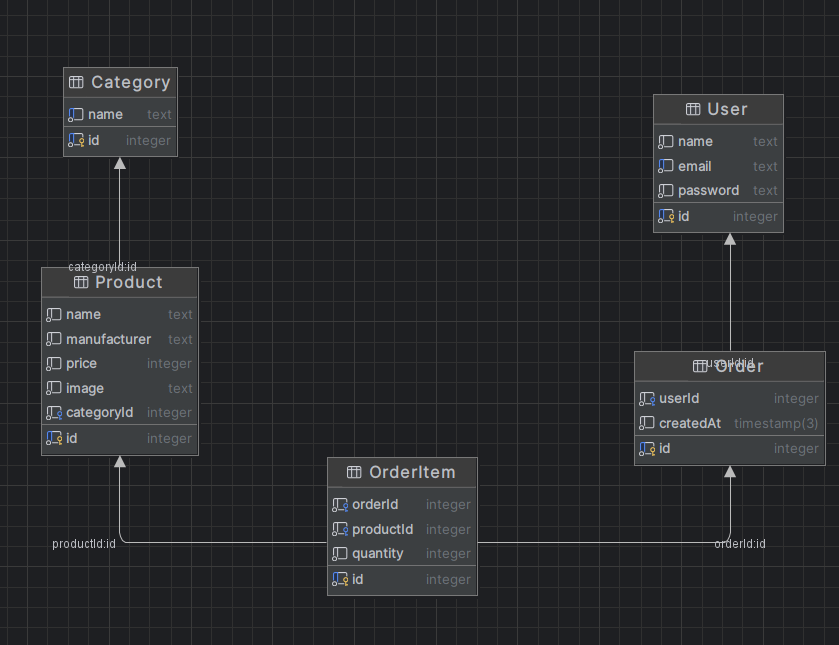

## Предметная область: Интернет-магазин автозапчастей

Разработанное приложение представляет собой интернет-магазин, предоставляющий пользователям возможность выбора и заказа
автомобильных запчастей. Система поддерживает функционал регистрации пользователей, оформление заказов, организацию
продуктов по категориям и управление позициями в заказах.

### Основные сущности предметной области:

### User (Пользователь)

Пользователь системы, который может регистрироваться, авторизовываться и оформлять заказы.

* `id` — уникальный идентификатор пользователя.
* `name` — имя пользователя.
* `email` — адрес электронной почты (уникальный).
* `password` — пароль для авторизации.

### Product (Продукт)

Автомобильная запчасть, представленная в магазине.

* `id` — уникальный идентификатор товара.
* `name` — название товара.
* `manufacturer` — производитель товара.
* `price` — цена товара.
* `image` — изображение товара.
* `categoryId` — ссылка на категорию товара.

### Category (Категория)

Группировка товаров по типам или назначению (например: двигатель, кузов, электрика).

* `id` — уникальный идентификатор категории.
* `name` — название категории.

### Order (Заказ)

Заказ, оформляемый пользователем, который может включать несколько позиций (товаров).

* `id` — уникальный идентификатор заказа.
* `userId` — ссылка на пользователя, оформившего заказ.
* `createdAt` — дата и время создания заказа.

### OrderItem (Позиция в заказе)

Конкретная автозапчасть, включённая в заказ, с указанием количества.

* `id` — уникальный идентификатор позиции заказа.
* `orderId` — ссылка на заказ, к которому относится позиция.
* `productId` — ссылка на товар, который добавлен в заказ.
* `quantity` — количество товара в позиции.

### Связи между сущностями:

* **User → Order**: один пользователь может оформлять много заказов (1 → N).
* **Order → OrderItem**: один заказ включает несколько товаров через позиции заказа (1 → N).
* **Product → OrderItem**: один продукт может быть включён во множество заказов через позиции заказа (1 → N).
* **Category → Product**: одна категория может содержать множество товаров (1 → N).

## ER-диаграмма

